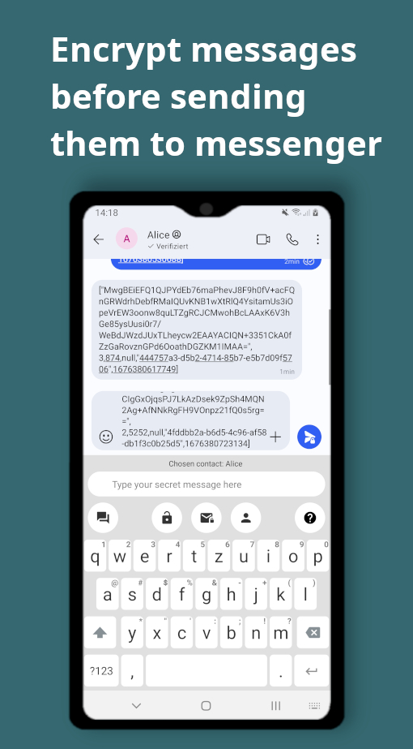
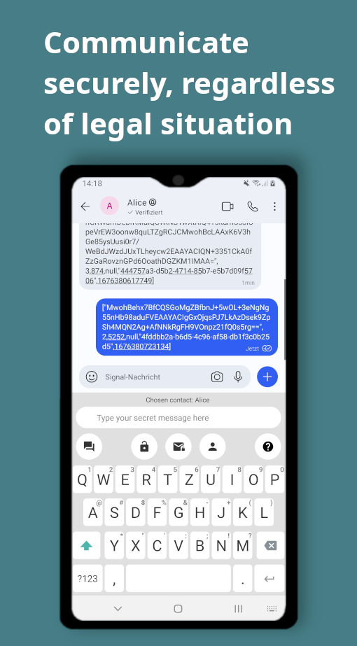
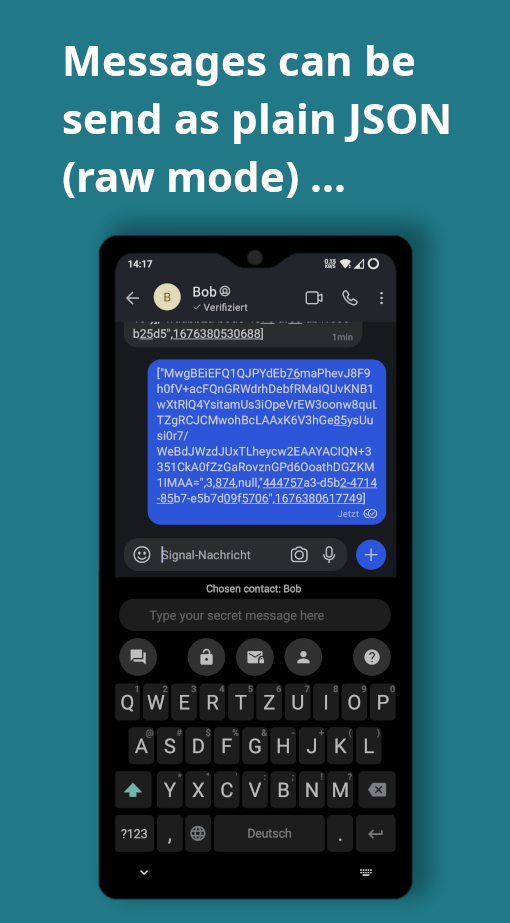
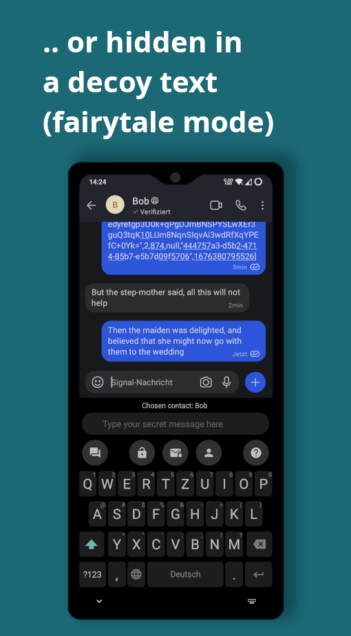
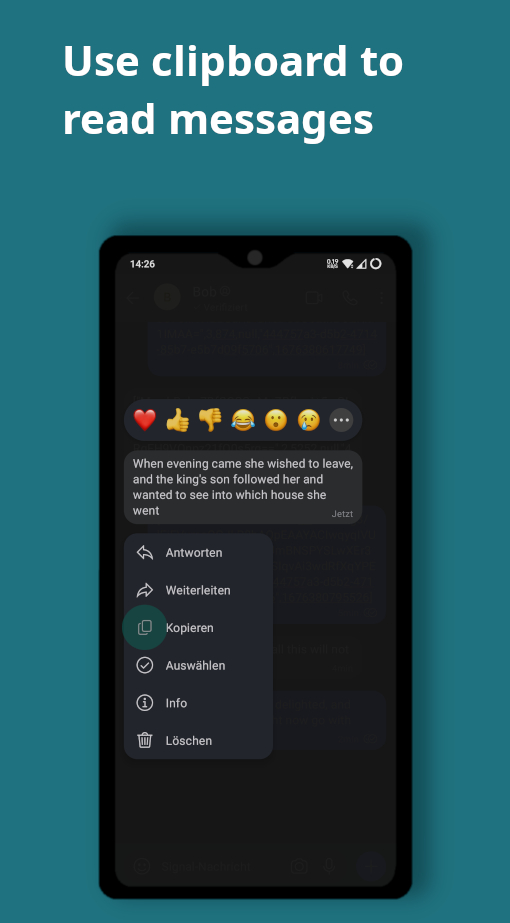
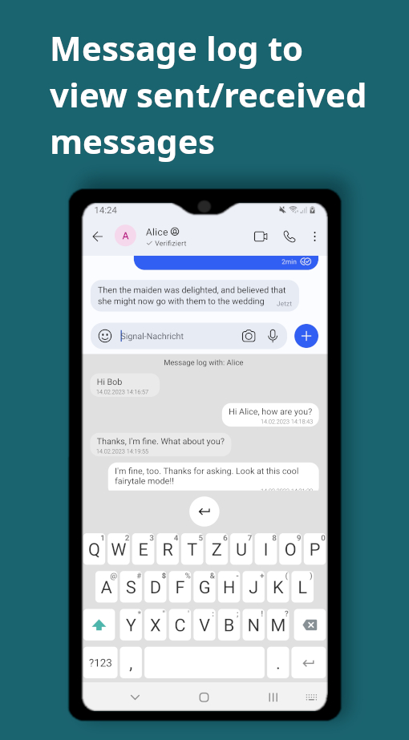
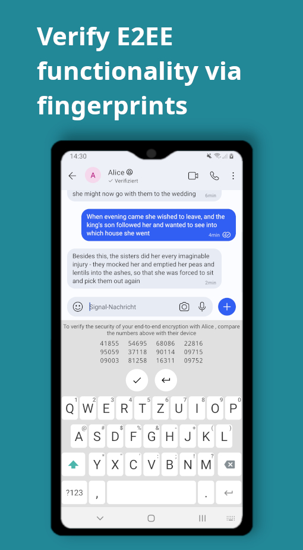
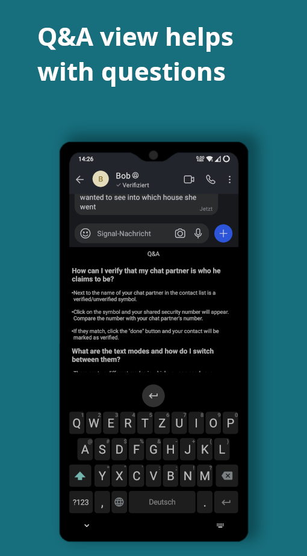

<h1 align="center">KryptEY - Secure E2EE communication</h1>

Keyboard for secure end-to-end-encrypted messages through the signal protocol in any messenger.
Communicate securely and independent, regardless of the legal situation or whether messengers use
E2EE. No server needed.

KryptEY was created by [mellitopia](https://github.com/mellitopia)
and [amnesica](https://github.com/amnesica).

## Motivation

Breaking of end-to-end encryption (E2EE) by laws such as the planned EU chat control is an ongoing
issue. Content in messengers that use E2EE, such as Whatsapp or Signal, could thus be monitored by
third parties. E2EE is often, but not always, standard in messengers. There are proven methods for
E2EE such as PGP. However, these methods are sometimes cumbersomely integrated and require a lot of
effort to use.

KryptEY is an Android keyboard that implements the Signal protocol. The keyboard works
messenger-independently and both the X3DH Key Agreement Protocol and the Double Ratchet Algorithm
work without a server, thus it enables a highly independent use of the protocol.

## Screenshots

  
  
  
  
  
  
  
  
  

## Features

Based upon the [Simple Keyboard](https://github.com/rkkr/simple-keyboard) KryptEY adds a view above
the Keyboard for the E2EE functionality.

- use E2EE through Signal Protocol in any messenger
- encryption/decryption of messages
- enter message through separate text field in keyboard
- use clipboard to read messages
- manage contacts in own contact list in keyboard
- message log to view sent/received messages
- send messages as plain JSON (raw mode) or hidden in a decoy text (fairytale mode)
- verification of E2EE functionality via fingerprint
- Q&A View helps with questions
- Dark & light theme

See [this](/KRYPTEY.md) document for further information on how KryptEY is working.

## Demo

Conversation between Alice (right) and Bob (left) in the Signal Messenger using KryptEY.

## Download

If you need instructions on how to use the app, see our help [here](/HELP.md)

## Privacy

Read our privacy statement [here](/PRIVACY.md)

## Permissions

- VIBRATE: Required for vibrations on key press

## Security

The existing security properties for the Signal Protocol are also valid for the keyboard.

The elliptic curve X25519 with SHA-512 is used in the X3DH Key Agreement Protocol from the applied
Signal library. The hash function SHA-256 is used for the various chains and AES-256 with CBC (
Pkcs#7) is used for the encryption of the messages. SHA-512 is also used to generate the
fingerprint, the representation of the public key used for encryption.

## Limitations

The keyboard was designed as a POC and only allows 1-to-1 conversations. However, the application
can also be used in a group chat to a limited extent. Here, a message can be directed to a
specific chat partner and not to all people. Other participants of the group chat cannot decrypt
the message.

Text messages in Telegram are getting copied as HTML and not as plain text. When decoding the
message with the fairytale mode the copied message is compromised and can't be read properly.
Therefore, it can't be decoded at all. However, the raw mode works properly. When using KryptEY
with Telegram we recommend the raw mode.

Some messengers like Threema only allows up to 3500 bytes per message. Therefore, different
character input limitations apply. To stay under the 3500 bytes limit, only 500 characters are
allowed for raw and fairytale mode. For convenience these limitation applies for all messengers.

## Used libraries

- [Signal Protocol (android)](https://github.com/signalapp/libsignal)
- [Jackson](https://github.com/FasterXML/jackson)
- [Protobuf (lite)](https://github.com/protocolbuffers/protobuf/tree/main/java)
- [JUnit4](https://github.com/junit-team/junit4)

## Credits

- [AOSP Keyboard](https://android.googlesource.com/platform/packages/inputmethods/LatinIME/)
- [Simple Keyboard](https://github.com/rkkr/simple-keyboard)
- [OpenBoard](https://github.com/openboard-team/openboard)
- [FlorisBoard](https://github.com/florisboard/florisboard)
